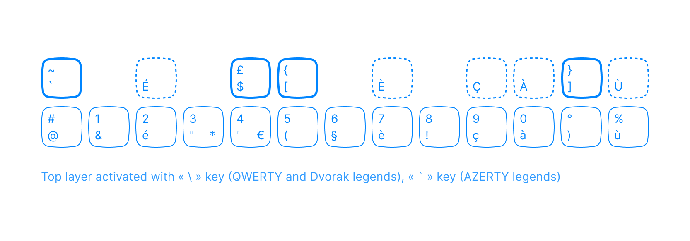

# Custom macOS keyboard layouts

The following keyboard layouts offer practical functionality to Dvorak typists and users of small keyboards on macOS.

## Installation

Bundles need to be placed in the `/Library/Keyboard Layouts` directory. 

Restart your machine.

Then install the layout in `System Settings > Keyboard > Keyboard layouts`. Click on the `+` button to add a new input source, then locate custom layouts in the `Others` category.

## Dvorak International

`Dvorak International` makes it easier for Dvorak users to type a number of diacritics and accents used in French, Spanish, and other languages. It does this by imitating the same system of dead-keys which many QWERTY users know thanks to the `U.S. International - PC` layout.

The layout also includes QWERTY commands.

## 30% International

`30% International` is a diacritics-focused layout based on `U.S. International` with small keyboards in mind (e.g. 30% or 40%). Is uses the semi-colon as a dead key for the circumflex accent, rather than the caret symbol, the latter being not as accessible with small form-factors.

The layout is meant to be used with external keyboards, and as such it is QWERTY; any alternate layouts are implemented directly on the external keyboard's controller.

## Dvorak FR numbers

As an alternate approach for typing French accents on Dvorak, this layouts replaces the Dvorak number row with an AZERTY number row — or very nearly.

A few modifications have been made in order to make the number row more Dvorak compatible.

- Redundant characters are replaced (green)
- An additional layer is added for more inputs and is activated with a dead key. Among other things, this layer makes typing uppercase accented letters more practical than in AZERTY.

## Dvorak to QWERTY

`Dvorak to QWERTY` allows an external Dvorak keyboard to be used as a QWERTY keyboard even if the QWERTY layout is not included in its firmware.

The layout achieves this conversion by mapping a QWERTY key's position to the QWERTY letter which occupies the position of that same key in the Dvorak layout.