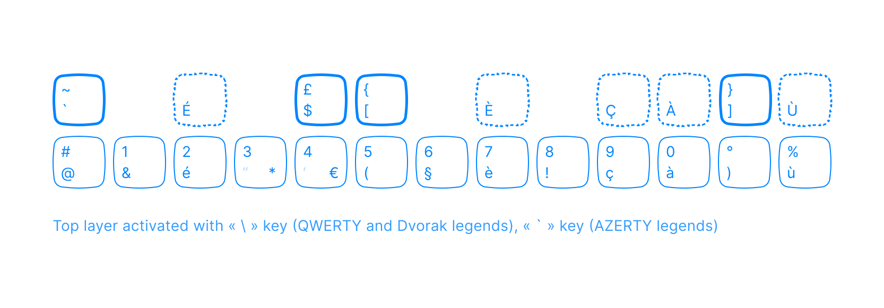

# Custom macOS keyboard layouts

The following keyboard layouts offer practical functionality to Dvorak typists and users of small keyboards on macOS.

Since these layouts run on your macOS machine, they can be used simultaneously to any custon firmware you've installed on an external keyboard, no configuration necessary.

## Installation

Bundles need to be placed in the `/Library/Keyboard Layouts` directory. 

Restart your machine.

Then install the layout by navigating to `System Settings > Keyboard > Keyboard layouts`. Click on the `+` button to add a new input source, then locate custom layouts in the `Others` category.

## Dvorak International

`Dvorak International` makes it easier to type a number of diacritics and accents used in French, Spanish, and other languages. It does this by imitating the same system of dead-keys which many QWERTY users know thanks to the `U.S. International - PC` layout. These include the following:

- `'` for acute accent (`é`) and cedilla (`ç`)
- `` ` `` for grave accent (`è`)
- `^` for circumflex (`ê`)
- `"` for dieresis (`ë`)
- `~` for tilde diacritic (`ñ`)

The layout also includes QWERTY commands.

## 30% International

`30% International` is a diacritics-focused layout based on `U.S. International` with small keyboards in mind (e.g. 30% or 40%). It exclusively uses alpha-block inputs for dead keys, making diacritics more accessible than in `U.S. International`, where characters like caret `^` and tilde `~` are used.

Dead keys which remain unchanged:

- `'` for acute accent (`é`) and cedilla (`ç`)
- `"` for dieresis (`ë`)

New 30% dead keys:

- `;` for circumflex (`ê`).
- `,` for grave accent (`è`).
- `<` (`shift-comma`) for tilde diacritic (`ñ`)

For ease of use, a couple of rules have been added for how dead-keys terminate to regular output:

- While the space key causes semi-colon and comma to terminate to their regular outputs, just as with any other dead key, it also inserts a typographical space following these two characters. Practically, this allows the regular typing experience to remain unchanged despite these two additional dead keys.
- The apostrophe `'` produces a typographic apostrophe `’` (or right single quotation mark) when terminated with the space bar. In order to obtain a regular apostrophe, terminate with the escape key.

The layout is meant to be used with external keyboards, and as such it is QWERTY; any alternate layouts can be implemented directly on the external keyboard's controller.

## Dvorak FR numbers

As an alternate approach for typing French accents on Dvorak, this layouts replaces the Dvorak number row with an AZERTY number row — or very nearly.

A few modifications have been made in order to make the number row more Dvorak compatible.

- Redundant characters are replaced (faded)
- An additional layer is added for more inputs and is activated with a dead key. Among other things, this layer makes typing uppercase accented letters more practical than in AZERTY.

## Dvorak to QWERTY

`Dvorak to QWERTY` allows an external Dvorak keyboard to be used as a QWERTY keyboard even if the QWERTY layout is not included in its firmware.

The layout achieves this conversion by mapping a QWERTY key's position to the QWERTY letter which occupies the position of that same key in the Dvorak layout.
